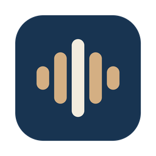

<p align="center">
  
</p>

<h1 align="center">Alpiste</h1>

<p align="center">
  
  
  
</p>

A macOS menu bar app that records a meeting, transcribes it, and writes structured notes
to `~/MeetingNotes/`. Granola-style, but everything stays on your machine.

No accounts, no cloud storage, no telemetry. The only network call is the one that turns
the transcript into notes, and even that is optional.

## What it does

1. Records system audio and your microphone with ScreenCaptureKit.
2. Mixes them into one `.m4a` with ffmpeg.
3. Transcribes with a local whisper.cpp `medium` model.
4. Sends the transcript out for a 5-bullet summary, decisions, and action items. Two
   providers are tried in order, and the order depends on transcript size: Groq leads up
   to 29,000 characters, Gemini above that. Whichever does not lead stays as the backup.
5. Writes `~/MeetingNotes/YYYY-MM-DD-HHMM.md` with the notes on top, the full transcript
   below a divider, and the audio alongside as `YYYY-MM-DD-HHMM.m4a`. The audio line also
   names which sources actually got captured (`system audio`, `microphone`, or both), and
   two recordings started in the same minute get `-2`, `-3`... appended instead of
   overwriting each other.

While a recording is in progress, its raw files live in
`~/Library/Application Support/Alpiste/captures/`, not in the system temp directory, so a
multi-hour meeting survives disk pressure.

## Auto-start on meetings

Off by default. Turn on **Auto-start on Meetings** in the menu and Alpiste offers to record
when it notices you have joined a call: a small floating panel with **Record** and **Not
now**, which times out after 90 seconds and never steals focus.

The trigger is audio, not the calendar. CoreAudio reports which processes hold the
microphone, so an event you never joined stays quiet and an unscheduled call is still
caught. A meeting app has to hold the microphone continuously for 20 seconds before the
panel appears, which is what keeps a voice note or a dictation blip from raising it.

Two apps are never treated as meetings, whatever the configuration says: **Wispr Flow**,
which holds the microphone all day for dictation, and **Alpiste itself**, which holds it
while recording and would otherwise trigger on its own capture. Matching is by bundle ID
prefix because the process that actually holds the device is a helper: a call in Chrome
shows up as `com.google.Chrome.helper`.

The calendar is context, not trigger. If Calendar.app has an event running when the panel
appears, its title becomes the note's heading and its end time schedules the stop. Without
one, the recording stops five minutes after the last meeting app lets go of the
microphone. A meeting that runs past its scheduled end is extended in ten-minute blocks
rather than being cut off, and **Stop Recording** always wins.

Calendar access is requested the first time you switch the feature on, never at launch.
Going without it costs you the title and the scheduled stop; everything else still works.

macOS shows that dialog exactly once, so the menu distinguishes the two ways of being
without it. **Allow Calendar Access…** appears while the dialog has never been answered and
raises it again. **Calendar Access Blocked — Open Settings** appears once it has been
refused, because at that point only System Settings can grant it. Granting it there is
picked up within a couple of seconds; no relaunch needed.

## Install

Download `Alpiste-<version>.dmg` from the [latest release](../../releases/latest), drag the
app to Applications and open it. The app is signed with a Developer ID and notarized by
Apple, so Gatekeeper lets it through. You still need the command-line pieces it shells out
to (`ffmpeg`, `whisper-cli`, the model and the `.env` file), which `scripts/setup.sh`
installs from a clone of this repo.

To build from source instead:

```sh
./scripts/setup.sh          # ffmpeg, whisper-cpp, the ~1.5 GB medium model, and ~/.alpiste/.env
xcodegen                    # generates Alpiste.xcodeproj from project.yml
xcodebuild -scheme Alpiste -configuration Release build
```

Then copy the built `Alpiste.app` to `/Applications` and open it. Either way it lives in the
menu bar only, with no Dock icon.

Requires macOS 15 or later. `SCStreamConfiguration.captureMicrophone`, which is how the app
gets your voice and the meeting audio from a single capture stream, does not exist before
that.

## Permissions to grant

Both are requested on your first **Start Recording**.

| Permission | Why | Where |
|---|---|---|
| **Screen Recording** | The only supported way to capture system audio on macOS. No video is ever written; the app captures a 2x2 pixel surface and throws every frame away. | System Settings > Privacy & Security > Screen Recording |
| **Microphone** | Records your side of the conversation. | System Settings > Privacy & Security > Microphone |
| **Calendars** | Optional, and only asked for when you turn on Auto-start on Meetings. Titles the note and schedules the stop. Nothing is ever written to your calendar. | System Settings > Privacy & Security > Calendars |

**Screen Recording only takes effect after you quit and reopen the app.** macOS applies it
at launch, so granting it mid-session silently does nothing. Alpiste tells you this when it
asks.

If you decline the microphone, recording still works; you just get the other side of the
call and not your own voice.

## Configuration

`~/.alpiste/.env`, created by `setup.sh`. Real environment variables override the file.

```sh
# Notes generation, first choice. Free tier: https://console.groq.com/keys
# Also transcribes when the local whisper model is missing.
GROQ_API_KEY=...
# GROQ_MODEL=             # defaults to openai/gpt-oss-120b

# Notes generation, fallback when Groq fails, and first choice above 29,000 characters.
# Free tier: https://aistudio.google.com/apikey. Capped at 20 requests a day, which is why
# it is second, but its context window is far larger.
# GEMINI_API_KEY=
# GEMINI_MODEL=           # defaults to gemini-flash-latest

# Meeting auto-start, all optional. Extra bundle ID prefixes to treat as meeting apps,
# comma separated; the deny list (Wispr Flow, Alpiste) cannot be overridden.
# MEETING_APPS=
# MEETING_DEBOUNCE_SECONDS=     # defaults to 20
# MEETING_STOP_GRACE_MINUTES=   # defaults to 5
# MEETING_OVERRUN_MINUTES=      # defaults to 10

# Optional transcription fallback. Only used when the local model is missing.
# OPENAI_API_KEY=
```

Groq's `on_demand` tier caps at 8,000 tokens per minute and refuses an oversized request
with **HTTP 413**, not 429, which reads like a payload limit without being one. That cap,
not the model's 131k context window, is what puts the 29,000-character threshold where it
is.

The path is absolute and fixed rather than relative to this repo, because the `.app` needs
to find it from wherever you install it.

## Offline

With `ggml-medium.bin` in place, transcription never touches the network. Leave
both API keys empty (or just stay offline) and you still get a complete file with the
full transcript; it simply notes that no summary was generated. That applies to both
keys: a summary needs at least one of them.

The local model always wins, but only while it keeps working: if whisper-cli crashes or
the model file is corrupt, transcription falls back to the API the same as if the model
were missing, rather than losing the transcript.

If a step fails, the meeting is still saved. The markdown gets written with whatever
succeeded plus a note about what broke, and the audio is always kept — the raw `.caf`
files are rescued next to the `.md` if even the mixing step fails. Network calls to
the notes providers and the transcription API retry with backoff on rate limits and
transient errors before giving up.

## Recovery

```sh
Alpiste --regenerate ~/MeetingNotes/2026-07-31-2214.md
```

Re-runs summarization on an already-written note file, in place, keeping its transcript.

You rarely need it: a recording that ends without notes schedules its own retries, and the
alert is deferred until those passes are spent, so a summary that recovers on its own never
interrupts you. Reach for `--regenerate` when the retries gave up, or when no notes key was
set at recording time.

What the app did is on disk at `~/Library/Logs/Alpiste/alpiste.log` (rotating at 2 MB, one
old file kept), reachable from the menu bar. It never records a key value or meeting
content, so it can be handed over as-is.

## Checks

```sh
Alpiste.app/Contents/MacOS/Alpiste --selftest
```

Asserts the `.env` parser, the markdown assembly and its `--regenerate` round-trip
(including the degraded no-notes path), filename collision handling, the
calendar-independent timestamp format, the meeting watcher's classifier and calendar
matching (including that Wispr Flow and Alpiste itself are never mistaken for a call), and
that `ffmpeg` resolves without a login shell PATH. It also actually runs the ffmpeg mixer twice, on synthetic tones, once for a single
source and once for system + mic, since a filtergraph regression is the kind of failure
only a real invocation catches. Exits non-zero on failure.

To see the meeting prompt without waiting for a real call:

```sh
Alpiste.app/Contents/MacOS/Alpiste --prompt-demo
```

It shows the panel, prints which button you clicked, and records nothing.

To exercise transcription without recording anything, whisper-cpp ships a sample:

```sh
whisper-cli -m ~/Library/Application\ Support/Alpiste/models/ggml-medium.bin \
            -f $(brew --prefix)/share/whisper-cpp/jfk.wav
```

## Release

```sh
./scripts/release.sh
```

Regenerates the icon, archives, signs with Developer ID, packages a DMG, notarizes it with
Apple, and staples the ticket. Requires a clean working tree, `xcodegen`, and Pillow (for
the icon). Output lands in `build/Alpiste-<version>.dmg`, where `<version>` comes from
`MARKETING_VERSION` in `project.yml`. Adjust the signing identity (`DEVELOPMENT_TEAM` in
`project.yml`, `teamID` in `scripts/ExportOptions.plist`) and the notary profile
(`NOTARY_PROFILE=...`, a keychain profile from `notarytool store-credentials`) to your own
team.

## The icon

`scripts/make-icon.py` draws it with Pillow and writes the whole `AppIcon.appiconset`.
No design tool and no external renderer involved, so the icon is reproducible from source:

```sh
python3 scripts/make-icon.py
```

Birdseed grains whose heights trace an audio waveform, in the Sparrow palette (navy tile,
sand grains, ivory crest). Five grains rather than seven because seven collapse into
hairlines once macOS scales the icon to 32px.

## Notes on the build

- `project.yml` is the source of truth. Run `xcodegen` after changing it; the `.xcodeproj`
  is gitignored.
- No app sandbox, hardened runtime on. The app shells out to `ffmpeg` and `whisper-cli`,
  which the sandbox would block. Same posture as the sibling
  [menubar-hide](https://github.com/junior-rj/menubar-hide) project.
- Homebrew binaries are located by probing `/opt/homebrew/bin` and `/usr/local/bin`
  directly. An app launched from Finder does not inherit your shell's PATH.

## Not included

Speaker diarization, a notes browser, live transcription, and any settings UI.
Configuration is the `.env` file and the model directory.

## Credits

- [whisper.cpp](https://github.com/ggml-org/whisper.cpp) (MIT) does the transcription, with
  the [Whisper](https://github.com/openai/whisper) `medium` weights from OpenAI (MIT),
  downloaded by `setup.sh` and never bundled here.
- [ffmpeg](https://ffmpeg.org) mixes the audio. It is called as an external binary that you
  install with Homebrew; nothing from it is linked into or redistributed with this app.
- [XcodeGen](https://github.com/yonaskolb/XcodeGen) (MIT) and
  [Pillow](https://python-pillow.org) are build-time only, for the project file and the icon.

All code in this repository is original.

## License

[MIT](LICENSE) © Sparrow Serviços e Soluções em Informática
