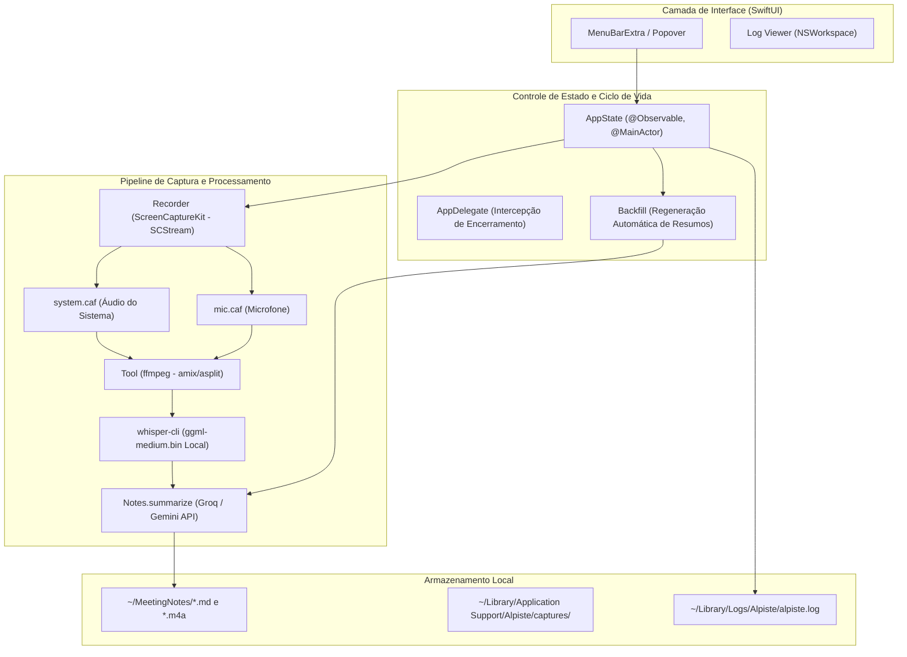

# Relatório de Auditoria Técnica e de Segurança — Alpiste

**Data da Auditoria:** 24 de agosto de 2026
**Versão do Projeto:** 0.4.0 (Build 6)
**Stack Tecnológica:** Swift 6.0, SwiftUI, ScreenCaptureKit, CoreMedia, whisper.cpp / whisper-cli, FFmpeg, XcodeGen
**Ambiente de Execução:** macOS 15.0+ (Apple Silicon / Intel)

---

## 1. Sumário Executivo

O **Alpiste** é uma aplicação nativa para macOS voltada para gravação, transcrição e geração de atas e notas estruturadas de reuniões com auxílio de inteligência artificial.

O sistema captura simultaneamente o áudio do sistema operacional e o microfone do usuário através do framework nativo `ScreenCaptureKit` (`SCStreamConfiguration.captureMicrophone`), realiza a mixagem em lote via `ffmpeg`, executa a transcrição local utilizando `whisper.cpp` (modelo `ggml-medium.bin`) e sumariza o conteúdo através de provedores de LLM configuráveis (Groq e Gemini) com fallback em cascata baseado no tamanho do texto transcrito.

---

## 2. Arquitetura e Engenharia de Software

O aplicativo é concebido como um utilitário exclusivo de barra de menus (`LSUIElement: true`), minimizando o consumo de recursos e operando com pipeline assíncrono não bloqueante.

### Destaques Técnicos:

1. **Resiliência contra Perda de Áudio:** O áudio capturado é gravado diretamente em `~/Library/Application Support/Alpiste/captures/` (protegido contra expurgo do sistema operacional). Caso ocorra falha na mixagem ou na API de IA, os arquivos brutos `.caf` e a gravação `.m4a` são imediatamente resgatados para `~/MeetingNotes`.
2. **Execução Segura de Subprocessos (`Tool.run`):** Execução assíncrona com passagem direta de argumentos via vetor `argv` (sem uso de `/bin/sh`), redirecionamento de streams para arquivo de log (evitando impasses de pipe buffer) e controle rígido de timeouts (30 minutos para tarefas padrão e até 4 horas para transcrições longas).
3. **Cascata Dinâmica de Sumarização:** Algoritmo que direciona textos de até 29.000 caracteres para o Groq (otimizando tempo de resposta e taxa de tokens) e inverte para o Gemini em reuniões mais longas com janelas de contexto estendidas.
4. **Recuperação Assíncrona (`Backfill`):** Rotina automática que detecta transcrições pendentes de resumo nos últimos 7 dias e executa reprocessamento em segundo plano sem travar a interface do usuário.

---

## 3. Auditoria de Segurança e Conformidade

| Vetor de Segurança                    |  Avaliação   | Análise Técnica                                                                                                                                                                               |
| ------------------------------------- | :----------: | --------------------------------------------------------------------------------------------------------------------------------------------------------------------------------------------- |
| **Gestão de Segredos**                |  **Forte**   | Chaves de API (`GROQ_API_KEY`, `GEMINI_API_KEY`, `OPENAI_API_KEY`) são carregadas de `~/.alpiste/.env` ou variáveis de ambiente. Nenhuma credencial é hardcoded.                              |
| **Sanitização de Logs Sensíveis**     |  **Forte**   | O módulo `Log.write` filtra ativamente dados confidenciais: registra apenas o tamanho do transcript e nomes de variáveis, nunca o áudio, chaves ou conteúdo textual da reunião.               |
| **Execução de Binários de Terceiros** | **Conforme** | Resolução estrita de caminhos de binários (`/opt/homebrew/bin`, `/usr/local/bin`, `/usr/bin`) através de `Tool.find`. Invocação segura via `Process.executableURL` sem interpolação de shell. |
| **Permissões de Sistema e TCC**       | **Conforme** | Entitlement `com.apple.security.device.audio-input` configurado. Declaração explícita de uso de microfone em `NSMicrophoneUsageDescription`.                                                  |
| **Hardened Runtime e Notarização**    | **Conforme** | `ENABLE_HARDENED_RUNTIME: YES` habilitado. Script de release automatizado com assinatura Developer ID e notarização Apple via `notarytool`.                                                   |
| **Privacidade dos Dados**             |  **Forte**   | A transcrição de áudio ocorre 100% on-device via whisper.cpp. Apenas o texto transcrito é transmitido via HTTPS para a API de resumo quando ativada.                                          |

---

## 4. Qualidade de Código, Concorrência e Padrões da Plataforma

- **Swift 6 Strict Concurrency:** Compilação com `SWIFT_STRICT_CONCURRENCY: complete`, isolamento de `AppState` em `@MainActor` e conformidade com `Sendable` no fluxo assíncrono.
- **Intercepção Graciosa de Encerramento:** `AppDelegate.applicationShouldTerminate` intercepta o fechamento do sistema (`Cmd+Q` ou logoff), aguarda a conclusão da persistência da gravação em andamento (`.terminateLater`) e impede corrupção de arquivos.
- **Auto-Teste Embutido (`SelfTest`):** O binário suporta execução de auto-diagnóstico (`--selftest`), validando parsers de ambiente, limites de tokens e execução do mixer de áudio sem necessidade de gravação ativa.

---

## 5. Matriz de Inconsistências e Vulnerabilidades Encontradas

| #   | Componente / Arquivo  | Tipo / Severidade             | Descrição do Problema                                                                                                                                               | Impacto Potencial                                                                                                                                                  | Mitigação Recomendada                                                                                                                                     |
| --- | --------------------- | ----------------------------- | ------------------------------------------------------------------------------------------------------------------------------------------------------------------- | ------------------------------------------------------------------------------------------------------------------------------------------------------------------ | --------------------------------------------------------------------------------------------------------------------------------------------------------- |
| 1   | `Alpiste/Notes.swift` | Média (Permissões de Arquivo) | O arquivo de configuração `~/.alpiste/.env` é criado com permissões padrão do sistema de arquivos durante o setup.                                                  | Outros processos locais não privilegiados no mesmo usuário podem ler as chaves de API caso as permissões do diretório/arquivo não sejam restritivas (`chmod 600`). | Forçar explicitamente permissão `0600` no arquivo `~/.alpiste/.env` e `0700` no diretório `~/.alpiste/` durante o `setup.sh` e na leitura em `Env.swift`. |
| 2   | `Alpiste/Notes.swift` | Baixa (Resiliência)           | Em chamadas de API para o Gemini / Groq, o tratamento de códigos HTTP de erro de cota (ex: 429 ou 413) tenta fallback imediatamente sem jitter/backoff exponencial. | Múltiplas gravações concorrentes ou backfills rápidos podem esgotar limites de taxa de provedores secundários em rajadas.                                          | Adicionar espera com jitter exponencial antes de acionar a segunda tentativa no provedor de reserva.                                                      |

---

## 6. Plano de Ação Priorizado e Recomendações

1. **Restrição de Permissões no `.env`:** Garantir no `setup.sh` e no código Swift que o arquivo de chaves `~/.alpiste/.env` possua permissões estritas `chmod 600`.
2. **Backoff Exponencial nas Chamadas LLM:** Implementar temporização com jitter entre tentativas de failover entre Groq e Gemini.

---

## 7. Veredito da Auditoria

- **Classificação Geral:** **Aprovado (Excelente)**
- **Postura de Segurança:** Alta (Execução local de IA, modelo de concorrência robusto, isolamento de processos e proteção de privacidade).
- **Conformidade Técnica:** Padrão rigoroso de engenharia para utilitários macOS 15+.
